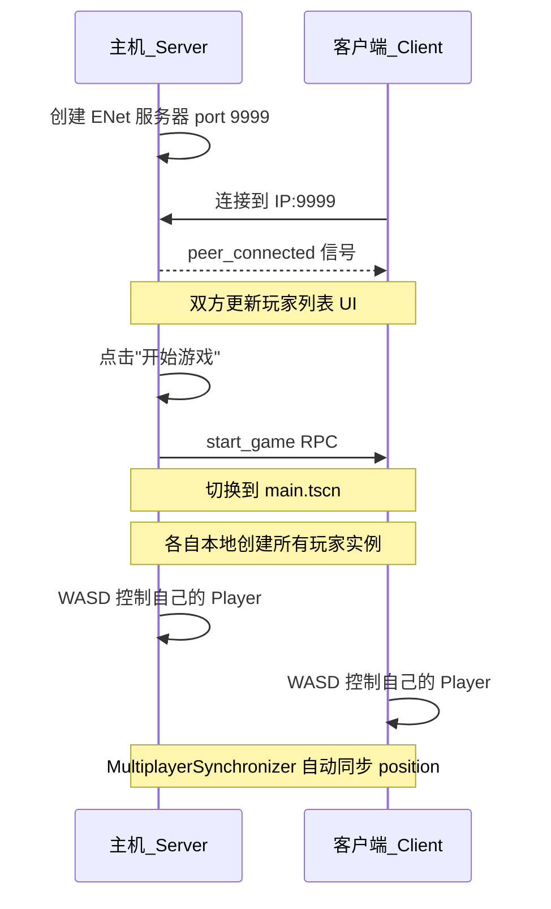

# 2D 局域网联机游戏 Demo 实现计划

## 架构总览




## 需要创建的文件（3 个脚本）

### 1. `Scripts/lobby.gd` - 大厅网络逻辑

核心逻辑：

- **创建服务器**: `ENetMultiplayerPeer.create_server(9999)` 设置为 multiplayer peer
- **加入游戏**: `ENetMultiplayerPeer.create_client(ip, 9999)` 连接到服务器
- 监听 `multiplayer.peer_connected` / `peer_disconnected` 信号更新玩家列表
- **开始游戏**: 通过 `@rpc("authority", "call_local", "reliable")` 调用 `get_tree().change_scene_to_file("res://Scenes/main.tscn")`
- 服务端显示"开始游戏"按钮，至少有1个其他玩家时可点击

### 2. `Scripts/main.gd` - 游戏场景逻辑

核心逻辑：

- `_ready()` 中通过 `multiplayer.get_peers()` 获取所有已连接的 peer ID
- 为每个 peer（包括自己）实例化 `player.tscn`，设置 `name = str(peer_id)`
- 调用 `set_multiplayer_authority(peer_id)` 设置每个玩家的网络权限
- 不同玩家设置不同初始位置，避免重叠

### 3. `Scripts/player.gd` - 玩家移动与同步

核心逻辑：

- `_ready()`: 根据 `name`（即 peer_id）设置 Label 显示 "Player X"
- `_physics_process()`: 仅 `is_multiplayer_authority()` 为 true 时处理输入
- 使用已配置的 `up/down/left/right` 输入映射（WASD），速度 300px/s
- 调用 `move_and_slide()` 移动，位置由 `MultiplayerSynchronizer` 自动同步

## 需要修改的文件（4 个文件）

### 4. `Scenes/lobby.tscn` - 重构为 UI 大厅

将空的 Node2D 重写为包含以下 UI 结构的场景：

```
lobby (Control) [全屏]
  MarginContainer [居中布局]
    VBoxContainer
      TitleLabel "2D 局域网联机 Demo"
      HBoxContainer -> Label "服务器IP:" + LineEdit (默认 127.0.0.1)
      HBoxContainer -> Button "创建服务器" + Button "加入游戏"  
      Label "玩家列表:"
      ItemList (显示已连接玩家)
      StartButton "开始游戏" (默认隐藏)
      StatusLabel (状态提示文字)
```

挂载 `Scripts/lobby.gd` 脚本。

### 5. `Scenes/main.tscn` - 添加 Players 容器

在现有蓝色背景基础上添加：

- `Players` (Node2D) - 作为所有玩家实例的父节点

挂载 `Scripts/main.gd` 脚本。

### 6. `Scenes/player.tscn` - 添加同步器

在现有 CharacterBody2D 基础上添加：

- `MultiplayerSynchronizer` 节点，配置 `SceneReplicationConfig` 同步 `position` 属性（replication_mode = always）

挂载 `Scripts/player.gd` 脚本。

### 7. `project.godot` - 设置主场景

- 将 `run/main_scene` 设为 `"res://Scenes/lobby.tscn"`（游戏启动时进入大厅）

## 关键技术要点

- **无需 Autoload**：`multiplayer.multiplayer_peer` 挂在 SceneTree 上，场景切换后连接仍然保持
- **无需 MultiplayerSpawner**：所有 peer 在 `main.gd` 的 `_ready()` 中本地创建相同的玩家实例，通过 `MultiplayerSynchronizer` 同步位置即可
- **输入映射**：项目已配置 WASD 为 up/down/left/right，同时会增加方向键映射

